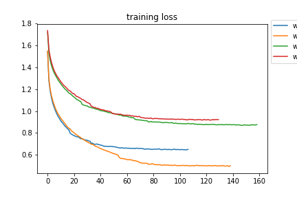
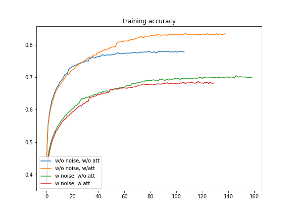
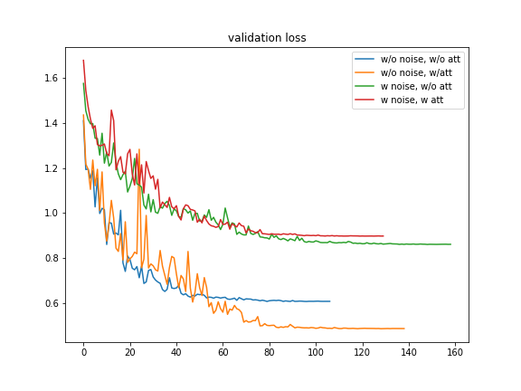
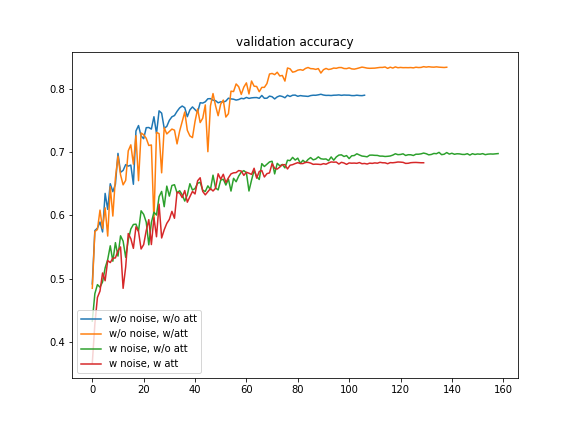

## Experiment with attention on the image stuffs

#### Why attention
Because I'm a neuroscientist! (TBD)

#### How attention works
TBD

#### Simple experiment (version 2018/04)
I do the experiment with the first version, which is refeneced by [Dan Vatterott](https://danvatterott.com/blog/2016/09/20/attention-in-a-convolutional-neural-net/) and the [github](https://github.com/dvatterott/BMM_attentional_CNN)

However, in the original version, several changes I've made
1. Convert it from theano backend to tensorflow backend
2. From MNIST to CIFAR-10 dataset with the very simple network (to speed it up...)

#### Experiment setting
1. Network structure: C.64 -> C.128 (w or w/o attention) -> C.256 -> D.10
2. Experiment with add noise or not (with Gaussian noise for both training and testing set)

#### Current conslusion
We got a little bit better result than one without attention in no noise condition. Howver, in the add noise condition, we got a different result from original one (Dan Vatterott's result). We've to identify the reason.

#### Results

